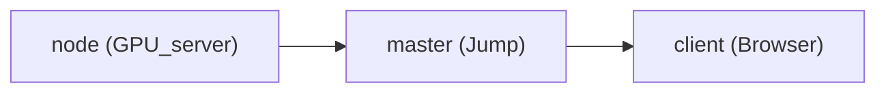

---
{"dg-home":false,"dg-publish":true}
---

# 如何利用 ssh 端口转发访问 Jupyter Lab

现有一台 GPU 服务器（node），与另一服务器（master）相连。GPU 服务器未接入网络，但 master 接入网络，此时可以采用两次 ssh 端口转发来搭建 Jupyter lab.

## 流程



1. 在 node 上运行以下命令打开 jupyter lab。此时可以在 master 中输入 `node:10886` 访问 jupyter lab
```shell
> jupyter notebook password
> jupyter lab --no-browser --ip="0.0.0.0" --port=10886
```

2. 但是 master 也是无界面的 commandline 模式，因此需要将 node 的 10886 端口转发一下。在 master 中运行以下命令，其中 `xx.xx.xx.xx` 是 master 的 ip（ip地址也可以用`localhost`代替）。

```shell
> ssh -N -f -L 10110:xx.xx.xx.xx:10886 user@node
```
3. 转发tensorboard的端口（运行tensorboard时指定端口为`6006`，转发至master的`16006`端口）

```shell
> ssh -N -f -L 16006:xx.xx.xx.xx:6006 user@node
```

3. 此时 node 的 jupyter lab 可以在 master 上通过 `xx.xx.xx.xx:10110` 进行访问。处于某些原因，有时可能需要将 master 的端口再转发至本地，即 localhost

```shell
> ssh -N -f -L 8888:localhost:10110 user@master
> ssh -N -f -L 6006:localhost:16006 user@master
```

## 其他
1. 若要停止 Linux 上的 ssh 端口转发，可以通过 `ps aux | grep ssh` 来查找进程，并 kill。
2. 一些参数

> -C 压缩传输
>  -f 将 SSH 传输转入后台执行
>  -N 建立静默连接
>  -g 允许远程主机连接本地用于转发的端口
>  -L 本地端口转发
